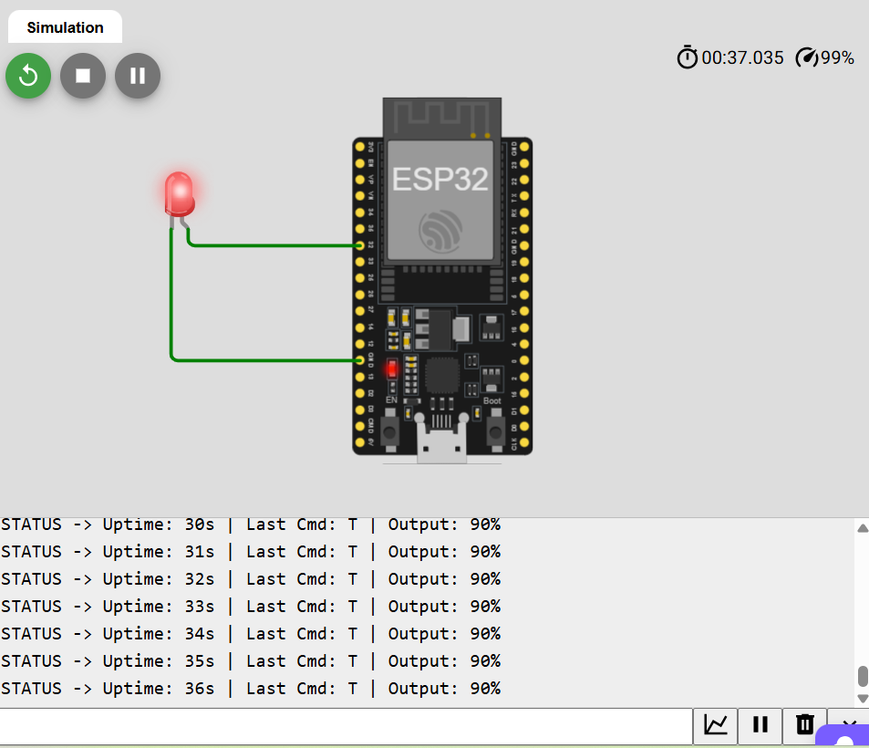

# CUERT Embedded & Control Task: RTOS Sensor-to-CAN Bridge

**Applicant:** Youssef Ahmed Sayed  
**Team:** Cairo University Eco-Racing Team (CUERT) - Embedded & Control Sub-Team (Recruitment Season 2026/2027)

## 📌 Hardware Choice & Justification
This firmware was developed and tested on an **ESP32**. 

*Important Note on STM32:* I am fully capable of and comfortable with implementing this system on an **STM32** architecture. However, due to the current physical unavailability of an STM32 board on my end, I opted for the ESP32. The ESP32 is an excellent alternative as its Arduino Core (v3.0+) is built natively on top of FreeRTOS, allowing me to fully demonstrate the required RTOS task management, queue handling, and safety-critical logic on real hardware.

To ensure proper hardware execution, **Pin 32** was used for the LED output instead of Pin 34/35, as I am aware that pins 34-39 on the ESP32 are Input-Only and cannot generate the required PWM signals.

## 🛠️ System Architecture (How I Made It)
The system is designed as a command-driven actuation node, utilizing **FreeRTOS** to manage four concurrent tasks communicating via a `QueueHandle_t`.

1. **Task 1: COMMAND_RX (Priority: 4 - Highest):** Listens to the UART, parses incoming plain-text commands, and pushes them to the queue. To strictly satisfy the requirement that a `BRAKE` command must never be dropped under load, `BRAKE` commands are pushed using `xQueueSendToFront` to guarantee immediate execution, bypassing any queued throttle commands.
2. **Task 2: ACTUATE (Priority: 3 - Medium):** Consumes the queue and drives the onboard LED using the ESP32 native `ledc` API (Core 3.0+). If a `BRAKE` is executed, it actively calls `xQueueReset` to flush any stale `THROTTLE` commands behind it, ensuring true override.
3. **Task 3: WATCHDOG / FAIL-SAFE (Priority: 2 - Low):** Monitors the timestamp of the last valid command. If 500ms elapse, it triggers a `fail_safe_active` flag, forces the PWM to 0, and initiates a distinctive blink pattern.
4. **Task 4: STATUS (Priority: 1 - Lowest):** Prints system telemetry (uptime, last command, and output percentage) every 1 second.

## 📝 Required Answers (Engineering Decisions)

**1. Why did you assign the task priorities the way you did?**
> I assigned the highest priority to `COMMAND_RX` because capturing incoming data without buffer overflow is the most critical operation; missing a command in a real-time system is unacceptable. `ACTUATE` was given medium priority to ensure parsed commands are executed immediately after reception. `WATCHDOG` is low priority because its 500ms timeout is a massive window in CPU time, allowing higher-priority tasks to run without interference. `STATUS` is the lowest as telemetry is purely for debugging and is non-critical.

**2. Why does a stale or missing BRAKE matter more than a stale STEER? How does your watchdog design guarantee the system actually fails safe, rather than just going quiet?**
> A missing `STEER` or `THROTTLE` means the vehicle merely maintains its current trajectory or speed, but a missing `BRAKE` command prevents the vehicle from stopping, leading to a catastrophic collision. My watchdog guarantees a true fail-safe by not only setting the PWM to 0 but also raising a `fail_safe_active` software flag. This flag physically blocks the `ACTUATE` task from processing any remaining stale throttle commands in the queue and enters an active blink loop until a new, valid command clears the flag. It doesn't just go quiet; it actively defends the zero-state.

**3. What would you add or fix first if you had one more day?**
> I would add a CRC (Cyclic Redundancy Check) or checksum validation to the parsing logic to ensure data integrity over the UART/CAN bus, preventing corrupted strings from being misinterpreted. Additionally, I would implement an Independent Hardware Watchdog Timer (IWDG) to physically reset the ESP32 in the rare event that the FreeRTOS scheduler itself freezes.

## 🚀 How to Run and Test (Serial Monitor)
To test the firmware precisely against the required validation script:

1. Connect the ESP32 via USB and open the **Serial Monitor** (Arduino IDE or similar).
2. Set the Baud Rate to **115200**.
3. **CRITICAL:** Set the line ending to **"Newline"** (or press Enter if using an external terminal) so the parser detects the end of the command.
4. Send the commands exactly as requested in the task brief:
   - `PING` (Expect: `PONG`)
   - `THROTTLE 40` (Expect: LED at 40%)
   - `STEER -60` (Expect: Status update only)
   - Send `THROTTLE 90` then immediately `BRAKE 100` (Expect: Immediate cutoff to 0%)
   - Wait > 500ms (Expect: `LINK LOST, failing safe` and blinking LED)
   - `THROTTLE 20` (Expect: Immediate recovery from fail-safe)

## 📷 Media & Proof of Execution

**1. Simulation (Wokwi Proof of Concept):**

**2. Live Hardware Execution (ESP32):**
[Watch the live hardware test on YouTube](ضع_رابط_فيديو_اليوتيوب_هنا)
